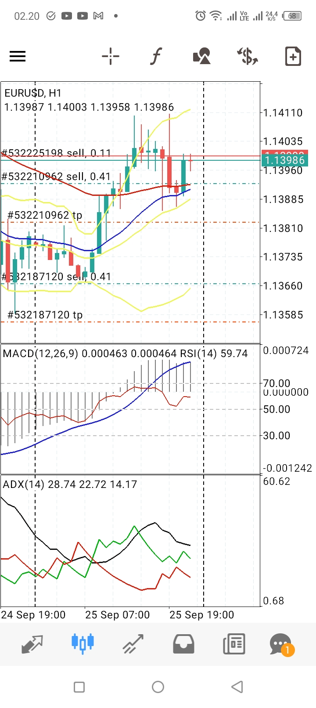

# Laporan Ekstraksi Chart Valas (EUR/USD)

**Waktu Pencatatan:** 26 September 2026, 02:20:37 WIB

## Indikator Teknikal
| Indikator | Nilai |
| :--- | :--- |
| **Harga Pembuka (Open)** | 1.14727 |
| **Harga Tertinggi (High)** | 1.14730 |
| **Harga Terendah (Low)** | 1.14667 |
| **Harga Penutup (Close)** | 1.14683 |
| **MACD** | -0.001626 |
| **RSI** | 35.67 |
| **ADX** | 25.97 |
| **EMA** | Tersedia |

## Lampiran Tangkap Layar

